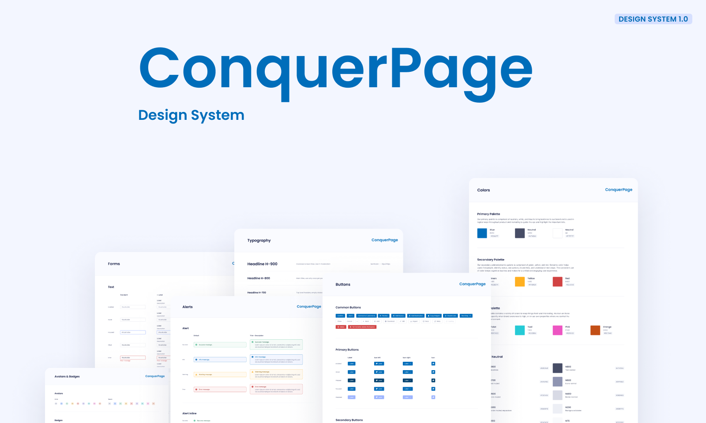
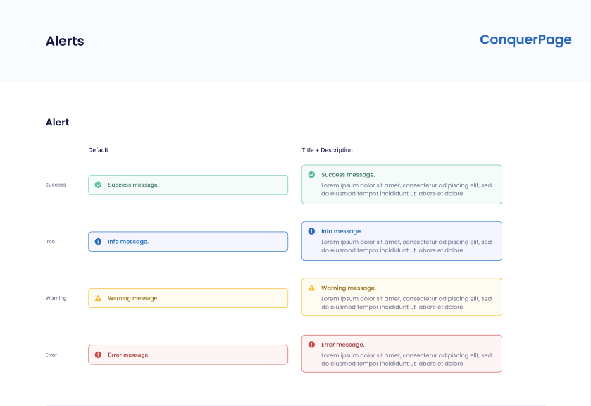
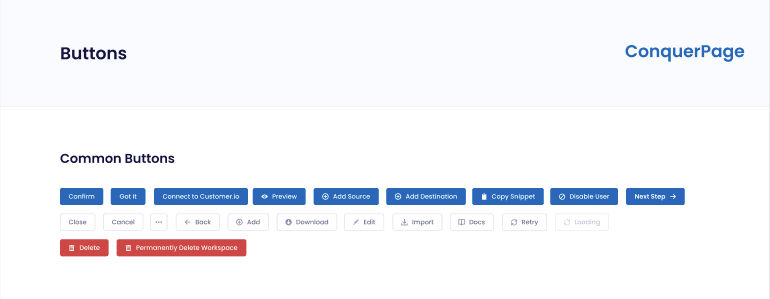
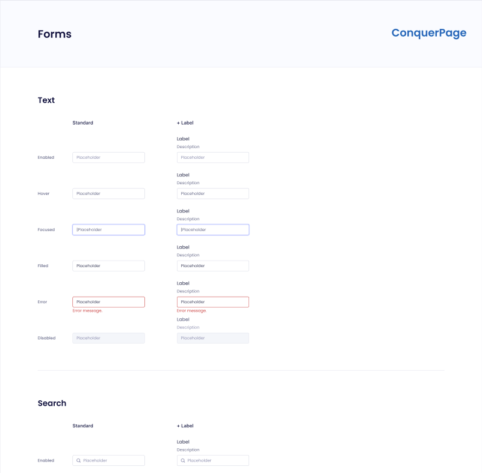
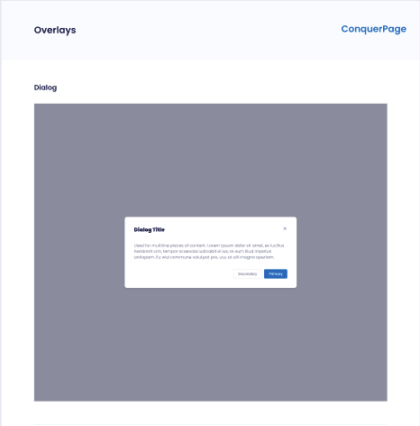

# Design System :art:



<br>
<div align="center">
 <a href="#project">👉 Project</a>
 <a href="#technologies">👉 Technologies</a>
 <a href="#execution">👉 Execution</a>
 <a href="#author">👉 Author</a>
</div>
<br>
<h2 id="project">Project</h2>
<br>

:warning: This project is in progress :warning:

<br>

This project is a design system that aims to standardize the UI/UX of a project, providing tools that facilitate the development of the project.
<br>
<br>
The Prototype of this project can be found in this [link from figma](https://www.figma.com/file/vIxnMQEEPAjl8YJRQxAC4f/Conquer-Page-Design-System), it was inspired by the [Evergreen v6 model](https://www.figma.com/community/file/974362403539471944).

<br>

<h3><a target="_blank" href="https://luiz-fellipe.github.io/conquer-page-design-system/?path=/story/atoms-button--primary">Project Demo Here</a></h3>


<br>

<h3 id="components">Metodology</h3>

<br>

In this project i followed the [Atomic Design Metodology](https://xd.adobe.com/ideas/process/ui-design/atomic-design-principles-methodology-101/)

<br>

<h3 id="tokens">Tokens</h3>
<br>

Tokens used in the standardization of the project, for example: colors, font types, font sizes, etc...

<br>

<a target="_blank" href="https://luiz-fellipe.github.io/conquer-page-design-system/?path=/story/tokens-colors--page">Check Tokens Demo Here</a>

<h5>How to use</h5>

```sh
npm install @conquerpage/tokens
```

```js
import {
  colors,
  fontSizes,
  fontWeights,
  fonts,
  radii,
  lineHeights,
  shadows,
  space,
  zIndices,
} from '@conquerpage/tokens'
```

<h3 id="components">Components Available</h3>
<br>

This project is in progress and has the following collection of Components available: <br> <br>

- <a href="#alerts">Alerts</a>
- <a href="#buttons">Buttons</a>
- <a href="#inputs">Inputs</a>
- <a href="#modals">Modals</a>
 
  
<br>
<hr>
<br>


<h4 id="alerts"><strong>Alerts</strong></h4>
  <br>

The implemented alerts have 4 variations: Success, Info, Warning and Danger. Besides having support for different sizes


<a target="_blank" href="https://luiz-fellipe.github.io/conquer-page-design-system?path=/story/atoms-alert--success">Check Alert Demo Here</a>

  
  <h5>How to use</h5>

```sh
npm install @conquerpage/react
```

```js
import { Alert } from '@conquerpage/react'

<Alert variant="info" title="Info Title" description="Info description" />
```

 <br>
 


<br>
<hr>
<br>

  <h4 id="buttons"><strong>Buttons</strong></h4>
  <br>

The implemented buttons have 5 variations: Primary, Secondary, Minimalist, Danger and Link. Besides having support for icons and different sizes

<a target="_blank" href="https://luiz-fellipe.github.io/conquer-page-design-system/?path=/story/atoms-button--primary">Check Button Demo Here</a>


 <h5>How to use</h5>

```sh
npm install @conquerpage/react
```

```js
import { Button } from '@conquerpage/react'

<Button variant="primary">My Button</Button>
```

  <br>

  

<br>
<hr>
<br>


  <h4 id="inputs"><strong>Inputs</strong></h4>
  <br>

The implemented inputs support auxiliary texts, icons, error messages, and adapt to different sizes.

<a target="_blank" href="https://luiz-fellipe.github.io/conquer-page-design-system/?path=/story/atoms-input--enabled">Check Input Demo Here</a>


<h5>How to use</h5>

```sh
npm install @conquerpage/react
```

```js
import { Input, InputWithIcon } from '@conquerpage/react'
import { faSearch } from '@fortawesome/free-solid-svg-icons'

<Input placeholder="My placeholder" defaultValue="Hello World" />

<InputWithIcon Icon={faSearch} placeholder="My placeholder" defaultValue="Hello World" />
```

  <br>

  

<br>
<hr>
<br>

  <h4 id="modals"><strong>Modals</strong></h4>
  <br>

The implemented modals follow accessibility rules and give the developer the freedom to customize their content or follow an already defined style pattern.

In this component we used the <a target="_blank" href="https://www.radix-ui.com/docs/primitives/components/dialog">Radix UI</a>

<a target="_blank" href="https://luiz-fellipe.github.io/conquer-page-design-system/?path=/story/molecules-overlay-modal-dialog--dialog">Check Modal Demo Here</a>

<h5>How to use</h5>

```sh
npm install @conquerpage/react
```

```js
import {   Modal,
  ModalProps,
  ModalContent,
  ModalTrigger,
  ModalWrapper } from '@conquerpage/react'
 
  <ModalComponent  onOpenChange={(open) => setOpen(open)} open={open}>
      <ModalTrigger asChild>
        <Button>Open Modal</Button>
      </ModalTrigger>
      <ModalWrapper>
        <ModalContent>
          <span>Your content here</span>
        </ModalContent>
      </ModalWrapper>
    </ModalComponent>
```

  <br>

  

<br>
<hr>
<br>

<h2 id="technologies">Used Technologies</h2>

<br>

This project was developed with the following technologies:

<br>

- <a target="_blank" href="https://nodejs.org/en/">Node 16.17</a>
- <a target="_blank" href="https://reactjs.org/">React 18.0</a>
- <a target="_blank" href="https://www.typescriptlang.org/">TypeScript 4.5.4</a>
- <a target="_blank" href="https://storybook.js.org/">Storybook</a>
- <a target="_blank" href="https://www.radix-ui.com/">Radix-UI</a>
- <a target="_blank" href="https://fontawesome.com/">Font Awesome</a>
- <a target="_blank" href="https://stitches.dev/">Stitches</a>
- <a target="_blank" href="https://eslint.org/">ESLint</a>
- <a target="_blank" href="https://jestjs.io">Jest</a>
- <a target="_blank" href="https://testing-library.com/">Testing Library</a>
- <a target="_blank" href="https://turbo.build/repo">TurboRepo</a>
- <a target="_blank" href="https://github.com/changesets/changesets/blob/main/packages/cli/README.md">ChangeSet</a>


<br>

<h2 id="execution">👨🏻‍💻 Execution</h2>
<br>

To run the project:
<br>


- First we have to:
  - Clone the project by running this command in the terminal `git clone <repo_url>`;
      <br>
      <br>
- Open the project folder in the terminal and run:
  - `yarn` or `npm install` -> To install all dependencies;
  - `yarn dev` or `npm run dev` -> To run the project;

<br><br>


<h2 id="author">👨🏻‍💻 Author</h2>

<br>

<h4>Luiz Fellipe<h4> 

<br>

[](https://www.linkedin.com/in/luiz-fellipe-da-silva-a5936b19a/)
[](https://github.com/Luiz-Fellipe)


